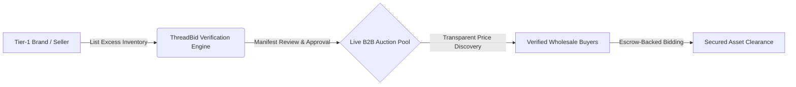

# ThreadBid — Institutional B2B Fashion Dead Stock Exchange

> An enterprise-grade secondary marketplace engineered to systematically connect Tier-1 fashion brands holding excess inventory with verified global wholesale buyers through highly competitive, transparent auction pools.

---

## 🚨 The Market Problem: The $4 Billion+ Dead Stock Crisis

Modern fashion retail operates under an inherent forecasting efficiency gap. Global apparel conglomerates continuously face significant unsold inventory overhangs—exemplified by corporate case studies like **H&M's infamous $4.3 billion+ surplus stock pile**. 

### The Core Challenges:
1. **Severe Capital Lock-Up**: Millions of dollars remain frozen inside storage warehouses, incurring continuous monthly float and warehousing expenses.
2. **Regulatory & Sustainability Pressures**: Global environmental mandates increasingly restrict or heavily penalize traditional inventory disposal methods such as stock incineration or direct landfill dumping.
3. **Inefficient Analog Liquidations**: Traditional secondary market sales rely on highly fragmented broker networks characterized by severe pricing opacity, massive commission markups, and exceptionally slow clearing workflows.

---

## 💡 The Solution: ThreadBid Marketplace

**ThreadBid** transforms wholesale liquidation into a transparent, frictionless electronic clearing exchange. By replacing lengthy offline broker negotiations with high-speed competitive auction pools, excess inventory finds optimal market-clearing prices instantly.

---

## 🏷️ Features for Sellers (Brands & Manufacturers)

ThreadBid equips fashion brands, export houses, and large-scale apparel manufacturers with a streamlined channel to recover tied-up capital while protecting brand equity.

* **Effortless Inventory Listing**: Quickly submit lot specifications, including accurate piece counts, category categorizations (e.g., Premium Cotton T-Shirts, Surplus Denims), fabric composition details, and comprehensive multi-angle container manifests.
* **Flexible Pricing Mechanics**: Establish absolute floor controls by configuring custom Starting Prices, hidden Reserve Prices, or immediate instant-clearing **Buy Now** valuations.
* **Rigorous Verification & Security**: Maintain clean market parameters through built-in **KYC verification boundaries** capturing valid **15-character GSTIN strings** and corporate **PAN identification signatures**.
* **Anti-Shill Bidding Guarantees**: Advanced access safeguards systematically prevent internal seller accounts from participating in active auction bidding pools, guaranteeing true pricing transparency.
* **Dedicated Seller Dashboard**: Track pending container moderation queues, monitor live active auctions, and oversee cleared net ledger distributions seamlessly.

---

## 🛒 Features for Buyers (Wholesale Distributors & Liquidators)

ThreadBid provides global inventory buyers, clearance outlets, and bulk apparel distributors with immediate access to uncompromised, verified Tier-1 surplus inventory lots.

* **Integrated Instant Clearing Wallet**: To eliminate repetitive multi-step payment gateway delays during fast-paced competitive liquidations, buyers maintain a built-in pre-funded **Secure Escrow Wallet**. Bids and instant **Buy Now** asset sweeps debit automatically in milliseconds, guaranteeing lightning-fast, continuous inventory acquisitions.
* **Real-Time Live Bidding**: Participate in continuous **24-hour institutional auction pools** featuring lightning-fast updates, visual status indicators, and countdown trackers.
* **Escrow-Backed Protection**: Secure high-value inventory orders confidently. All transaction bids are backed natively by verified, physical user wallet escrow structures ensuring zero counterparty default risks.
* **Transparent Price Discovery**: Bid history pipelines provide total pricing transparency, mapping physical system sequence tracking strings alongside clear incremental values.
* **Instant Container Sweep (Buy Now)**: Bypass multi-day bidding increments entirely by triggering immediate escrow allocations on container lots listed with custom instant sweep thresholds.
* **Unified Buyer Dashboard**: Manage active competitive stakes, monitor custom lot targets, deposit secure nodal ledger floats, and track cleared lot title distributions across a centralized, highly responsive control interface.

---

## 🔐 Core Platform Integrity

ThreadBid is committed to maintaining an uncompromised trading standard suited for enterprise supply chain operations:
* **Mandatory Earnest Money Deposit (EMD)**: To completely eradicate non-serious actors, malicious price inflation, and automated shill bidding, participating buyers must maintain a verified nodal wallet balance. Bidding access requires an upfront security lock, ensuring every competitive bid placed represents physical, available institutional liquidity.
* **Absolute Auction Fairness**: Dynamic system countdown controls operate against centralized server time constraints to ensure identical auction closing deadlines for all distributed participants.
* **Continuous Cross-Tab Synchronization**: Real-time state trackers guarantee that active balance reservations, status badges (`✓ Winning`), and auction card timelines remain consistently accurate across multiple operating windows.
